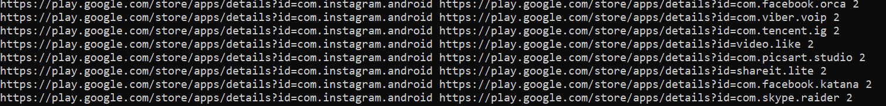
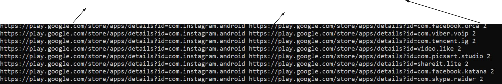
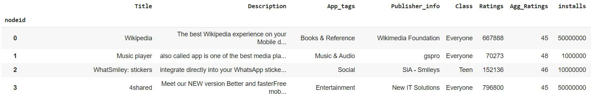
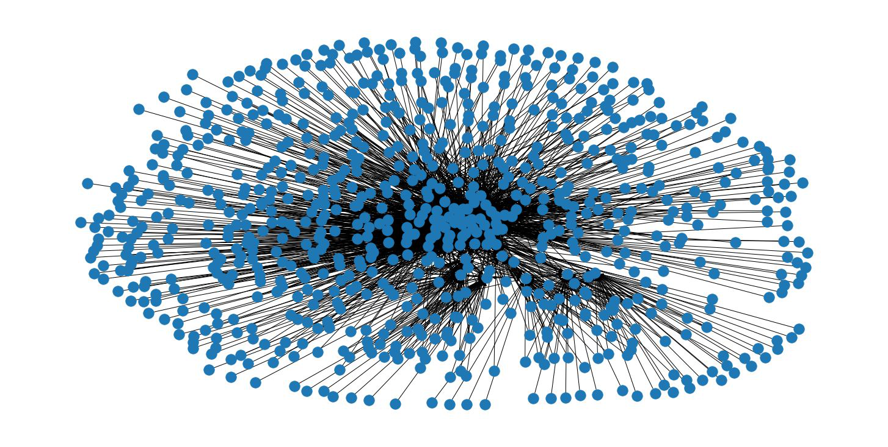
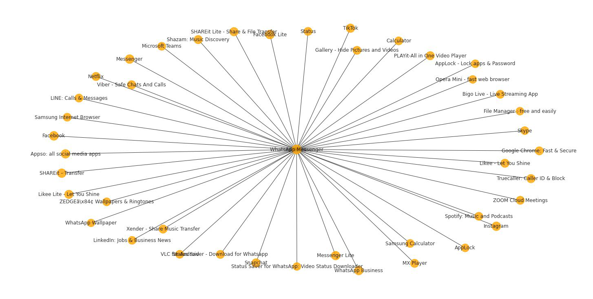

+-----------------------------------------------------------------------+
| > **Analysis of Google**                                              |
+=======================================================================+
+-----------------------------------------------------------------------+

+-----------------------------------------------------------------------+
| > **Playstore**                                                       |
+=======================================================================+
+-----------------------------------------------------------------------+

+-----------------------------------------------------------------------+
| > **Apps**                                                            |
+=======================================================================+
+-----------------------------------------------------------------------+

+-----------------------------------------------------------------------+
| > Scraped 780 apps from play.google.com                               |
+=======================================================================+
+-----------------------------------------------------------------------+

+-----------------------------------------------------------------------+
| > Contains a total of 3 million apps.                                 |
+=======================================================================+
+-----------------------------------------------------------------------+

+-----------------------------------------------------------------------+
| > **View of the Page**                                                |
+=======================================================================+
+-----------------------------------------------------------------------+

+-----------------------------------------------------------------------+
| > Since Appstore app pages provide links to similar apps.             |
+=======================================================================+
+-----------------------------------------------------------------------+

+-----------------------------------------------------------------------+
| > {width="6.058333333333334in" |
| > height="2.702777777777778in"}                                       |
+=======================================================================+
+-----------------------------------------------------------------------+

+-----------------------------------------------------------------------+
| > **Crawling method**                                                 |
+=======================================================================+
+-----------------------------------------------------------------------+

+-----------------------------------------------------------------------+
| > Wrote a recursive crawler that takes the number of hops for         |
| > crawling                                                            |
+=======================================================================+
+-----------------------------------------------------------------------+

+-----------------------------------------------------------------------+
| > Reason for this is to reverse engineer and capture the similarity   |
| > information from the playstore and eventually to derive a graph     |
| > with possible connections between nodes.                            |
+=======================================================================+
+-----------------------------------------------------------------------+

+-----------------------------------------------------------------------+
| > Try to obtain all the apps that are similar to a given app and also |
| > try to go a certain depth in that direction.                        |
+=======================================================================+
+-----------------------------------------------------------------------+

> **Results of this
> crawl**{width="9.191666666666666in"
> height="1.1086034558180227in"}{width="9.194444444444445in"
> height="1.5555555555555556in"}

  -----------------------------------------------------------------------
  Destination App         Src App                 Hop
  ----------------------- ----------------------- -----------------------

  -----------------------------------------------------------------------

+-----------------------------------------------------------------------+
| > **Results continued**                                               |
+=======================================================================+
+-----------------------------------------------------------------------+

+-----------------------------------------------------------------------+
| > Crawled all the unique URLS derived from the set of (source ,       |
| > destination) to create a node set.                                  |
+=======================================================================+
+-----------------------------------------------------------------------+

+-----------------------------------------------------------------------+
| > Used the information from the source and destination app at with    |
| > depth set 2 to generate Edge                                        |
+=======================================================================+
+-----------------------------------------------------------------------+

+-----------------------------------------------------------------------+
| > pairs for Apps.                                                     |
+=======================================================================+
+-----------------------------------------------------------------------+

+-----------------------------------------------------------------------+
| > Derived 780 Nodes and 2300 edge connections between them.           |
+=======================================================================+
+-----------------------------------------------------------------------+

+-----------------------------------------------------------------------+
| > All these edges are assumed to be Directed edges                    |
+=======================================================================+
+-----------------------------------------------------------------------+

+-----------------------------------------------------------------------+
| > **Node features captured for these 780 Apps**                       |
+=======================================================================+
+-----------------------------------------------------------------------+

> {width="9.466666666666667in"
> height="1.5888877952755907in"}

+-----------------------------------------------------------------------+
| > **Constructing the Graph**                                          |
+=======================================================================+
+-----------------------------------------------------------------------+

+-----------------------------------------------------------------------+
| > Constructed a Digraph and looks like below with all connections.    |
+=======================================================================+
+-----------------------------------------------------------------------+

  ---------------------------------------------------------------------------------------------
  {width="5.155555555555556in"
  height="2.6027766841644793in"}
  ---------------------------------------------------------------------------------------------

  ---------------------------------------------------------------------------------------------

+-----------------------------------------------------------------------+
| > **Analysing the graph**                                             |
+=======================================================================+
+-----------------------------------------------------------------------+

+-----------------------------------------------------------------------+
| > Found the following properties of the graph for starters            |
+=======================================================================+
+-----------------------------------------------------------------------+

+-----------------------------------------------------------------------+
| > Density of the graph.                                               |
+=======================================================================+
+-----------------------------------------------------------------------+

+-----------------------------------------------------------------------+
| > Centrality measures (Closeness and betweenness centrality)          |
+=======================================================================+
+-----------------------------------------------------------------------+

+-----------------------------------------------------------------------+
| > Found neighbours for each Node (App) in-order to investigate        |
| > centrality measures                                                 |
+=======================================================================+
+-----------------------------------------------------------------------+

+-----------------------------------------------------------------------+
| > **Betweeness centrality of nodes**                                  |
+=======================================================================+
+-----------------------------------------------------------------------+

+-----------------------------------------------------------------------+
| > Found betweenness centrality of all nodes.                          |
+=======================================================================+
+-----------------------------------------------------------------------+

+-----------------------------------------------------------------------+
| > Ranked these nodes based on betweeness centrality                   |
+=======================================================================+
+-----------------------------------------------------------------------+

+-----------------------------------------------------------------------+
| > And investigated subgraphs stemming for this node. Example node:    |
| > Whatsapp:                                                           |
+=======================================================================+
+-----------------------------------------------------------------------+

+-----------------------------------------------------------------------+
| > nodeid: 25                                                          |
+=======================================================================+
+-----------------------------------------------------------------------+

+-----------------------------------------------------------------------+
| > **Subgraph of Whatsapp and its neighbours.**                        |
+=======================================================================+
+-----------------------------------------------------------------------+

+-----------------------------------------------------------------------+
| +------------------------------------------------------------------+  |
| | > {width="6.293055555555555in" |  |
| | > height="2.7819444444444446in"}                                 |  |
| +==================================================================+  |
| +------------------------------------------------------------------+  |
+=======================================================================+
+-----------------------------------------------------------------------+

+-----------------------------------------------------------------------+
| > **This cluster of apps including whatsapp showed a**                |
+=======================================================================+
+-----------------------------------------------------------------------+

> **strong Triadic relationship**

+-----------------------------------------------------------------------+
| > Found the number of triangles that include whatsapp(node 25) as one |
| > of the vertices.                                                    |
+=======================================================================+
+-----------------------------------------------------------------------+

+-----------------------------------------------------------------------+
| > {width="5.1152766841644794in" |
| > height="2.583332239720035in"}                                       |
+=======================================================================+
+-----------------------------------------------------------------------+

+-----------------------------------------------------------------------+
| > **Whatsapp and its neighbours based on**                            |
+=======================================================================+
+-----------------------------------------------------------------------+

> **betweenness Centrality**

+-----------------------------------------------------------------------+
| > Reason for this is to find whatsapps position in the graph          |
| > structure with directly connected neighbours                        |
+=======================================================================+
+-----------------------------------------------------------------------+

+-----------------------------------------------------------------------+
| > at 1 hop that are important in information discharge in the         |
| > network.                                                            |
+=======================================================================+
+-----------------------------------------------------------------------+

+-----------------------------------------------------------------------+
| > Is whatsapp connected to other nodes that exhibit a high            |
| > betweenness centrality                                              |
+=======================================================================+
+-----------------------------------------------------------------------+

+-----------------------------------------------------------------------+
| > How do we evaluate the importance of some individuals in a network? |
+=======================================================================+
+-----------------------------------------------------------------------+

+-----------------------------------------------------------------------+
| > Is whatsapp a node who is hyper-connected with many more nodes that |
| > are important in that                                               |
+=======================================================================+
+-----------------------------------------------------------------------+

+-----------------------------------------------------------------------+
| > category?.                                                          |
+=======================================================================+
+-----------------------------------------------------------------------+

+-----------------------------------------------------------------------+
| > {width="7.338888888888889in" |
| > height="4.969443350831146in"}                                       |
+=======================================================================+
+-----------------------------------------------------------------------+

+-----------------------------------------------------------------------+
| > **Plotting closeness centrality measures for**                      |
+=======================================================================+
+-----------------------------------------------------------------------+

> **Whatsapp and its neighbours**

+-----------------------------------------------------------------------+
| > To Derive how close whatsapp is to other nodes in the network.      |
+=======================================================================+
+-----------------------------------------------------------------------+

+-----------------------------------------------------------------------+
| > Results in next slide---\>                                          |
+=======================================================================+
+-----------------------------------------------------------------------+

{width="9.783333333333333in"
height="4.938888888888889in"}

+-----------------------------------------------------------------------+
| > **Plotting the categories that whatsapp is most**                   |
+=======================================================================+
+-----------------------------------------------------------------------+

> **connected to**

+-----------------------------------------------------------------------+
| > To check if whatsapp is connected to categories that are similar in |
| > function( Messaging,                                                |
+=======================================================================+
+-----------------------------------------------------------------------+

+-----------------------------------------------------------------------+
| > Social etc)                                                         |
+=======================================================================+
+-----------------------------------------------------------------------+

+-----------------------------------------------------------------------+
| > Plot in next page---\>                                              |
+=======================================================================+
+-----------------------------------------------------------------------+

+-----------------------------------------------------------------------+
| > **Whatsapp has most connections in Communication,**                 |
+=======================================================================+
+-----------------------------------------------------------------------+

+-----------------------------------------------------------------------+
| > **Social and tools category**                                       |
|                                                                       |
| +------------------------------------------------------------------+  |
| | > {width="5.323611111111111in" |  |
| | > height="3.165277777777778in"}                                  |  |
| +==================================================================+  |
| +------------------------------------------------------------------+  |
+=======================================================================+
+-----------------------------------------------------------------------+

+-----------------------------------------------------------------------+
| > **Y-Axis betweenness centrality, X-axis nodes**                     |
+=======================================================================+
+-----------------------------------------------------------------------+

> **connected to whatsapp**

+-----------------------------------------------------------------------+
| > {width="6.105555555555555in" |
| > height="2.9763888888888888in"}                                      |
+=======================================================================+
+-----------------------------------------------------------------------+

+-----------------------------------------------------------------------+
| > **Categories and their density in the dataset**                     |
+=======================================================================+
+-----------------------------------------------------------------------+

+-----------------------------------------------------------------------+
| +------------------------------------------------------------------+  |
| | > {width="5.6375in" |  |
| | > height="3.3513888888888888in"}                                 |  |
| +==================================================================+  |
| +------------------------------------------------------------------+  |
+=======================================================================+
+-----------------------------------------------------------------------+

+-----------------------------------------------------------------------+
| > **Violin plots for Average Rating vs Categories**                   |
+=======================================================================+
+-----------------------------------------------------------------------+

+-----------------------------------------------------------------------+
| +------------------------------------------------------------------+  |
| | > {width="7.468054461942257in" |  |
| | > height="3.4680555555555554in"}                                 |  |
| +==================================================================+  |
| +------------------------------------------------------------------+  |
+=======================================================================+
+-----------------------------------------------------------------------+

+-----------------------------------------------------------------------+
| > **Counts of Apps vs their categories**                              |
+=======================================================================+
+-----------------------------------------------------------------------+

+-----------------------------------------------------------------------+
| +------------------------------------------------------------------+  |
| | > {width="5.836111111111111in" |  |
| | > height="3.4513877952755907in"}                                 |  |
| +==================================================================+  |
| +------------------------------------------------------------------+  |
+=======================================================================+
+-----------------------------------------------------------------------+

+-----------------------------------------------------------------------+
| > **App user category vs counts**                                     |
+=======================================================================+
+-----------------------------------------------------------------------+

+-----------------------------------------------------------------------+
| > {width="6.416665573053368in" |
| > height="3.558333333333333in"}                                       |
+=======================================================================+
+-----------------------------------------------------------------------+

+-----------------------------------+-----------------------------------+
| **Continued**                     |                                   |
+===================================+===================================+
|                                   | +------------------------------+  |
|                                   | | > { |  |
|                                   | | width="4.3805555555555555in" |  |
|                                   | | > he                         |  |
|                                   | | ight="3.9499989063867016in"} |  |
|                                   | +==============================+  |
|                                   | +------------------------------+  |
+-----------------------------------+-----------------------------------+

+-----------------------------------------------------------------------+
| > **Apps user Category vs installs**                                  |
+=======================================================================+
+-----------------------------------------------------------------------+

+-----------------------------------------------------------------------+
| > {width="5.284722222222222in" |
| > height="3.6041666666666665in"}                                      |
+=======================================================================+
+-----------------------------------------------------------------------+

+-----------------------------------------------------------------------+
| > **Next steps**                                                      |
+=======================================================================+
+-----------------------------------------------------------------------+

+-----------------------------------------------------------------------+
| > Finding correlation between these features.                         |
+=======================================================================+
+-----------------------------------------------------------------------+

+-----------------------------------------------------------------------+
| > Capturing the notion of popularity as a function of                 |
| > features(ratings,installs,category,Tags).                           |
+=======================================================================+
+-----------------------------------------------------------------------+

+-----------------------------------------------------------------------+
| > **Converting the problem to a Supervised**                          |
+=======================================================================+
+-----------------------------------------------------------------------+

> **classification problem**

+-----------------------------------------------------------------------+
| > Can we correctly classify the apps to their right Category (App     |
| > category)                                                           |
+=======================================================================+
+-----------------------------------------------------------------------+

  -----------------------------------------------------------------------
  Model this problem into to use Graph neural network for classification
  and prediction activities and use
  -----------------------------------------------------------------------

  -----------------------------------------------------------------------

+-----------------------------------------------------------------------+
| > centrality measures as node features to reinforce importance.       |
+=======================================================================+
+-----------------------------------------------------------------------+

+-----------------------------------------------------------------------+
| > Generate embeddings for these nodes from graph classification and   |
| > apply dimensionality reduction to                                   |
+=======================================================================+
+-----------------------------------------------------------------------+

+-----------------------------------------------------------------------+
| > study cluster separation.                                           |
+=======================================================================+
+-----------------------------------------------------------------------+

+-----------------------------------------------------------------------+
| > **Regression: Predicting ratings for the App**                      |
+=======================================================================+
+-----------------------------------------------------------------------+

+-----------------------------------------------------------------------+
| +------------------------------------------------------------------+  |
| | > Possible rating to indicate its popularity.                    |  |
| +==================================================================+  |
| +------------------------------------------------------------------+  |
+=======================================================================+
+-----------------------------------------------------------------------+

+-----------------------------------------------------------------------+
| > **Counterfeiting problem**                                          |
+=======================================================================+
+-----------------------------------------------------------------------+

  -----------------------------------------------------------------------
  Eventually try to derive similarity measures for counterfeit Apps
  through how similar the embeddings are
  -----------------------------------------------------------------------

  -----------------------------------------------------------------------

+-----------------------------------------------------------------------+
| > to a popular app and derive a rating (TODO).                        |
+=======================================================================+
+-----------------------------------------------------------------------+

+-----------------------------------------------------------------------+
| > **Questions?**                                                      |
+=======================================================================+
+-----------------------------------------------------------------------+
